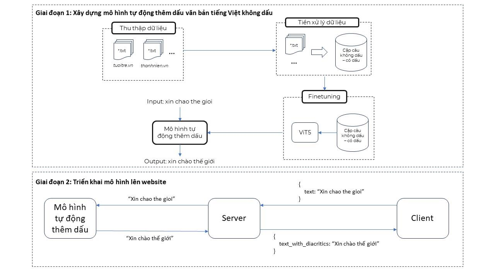
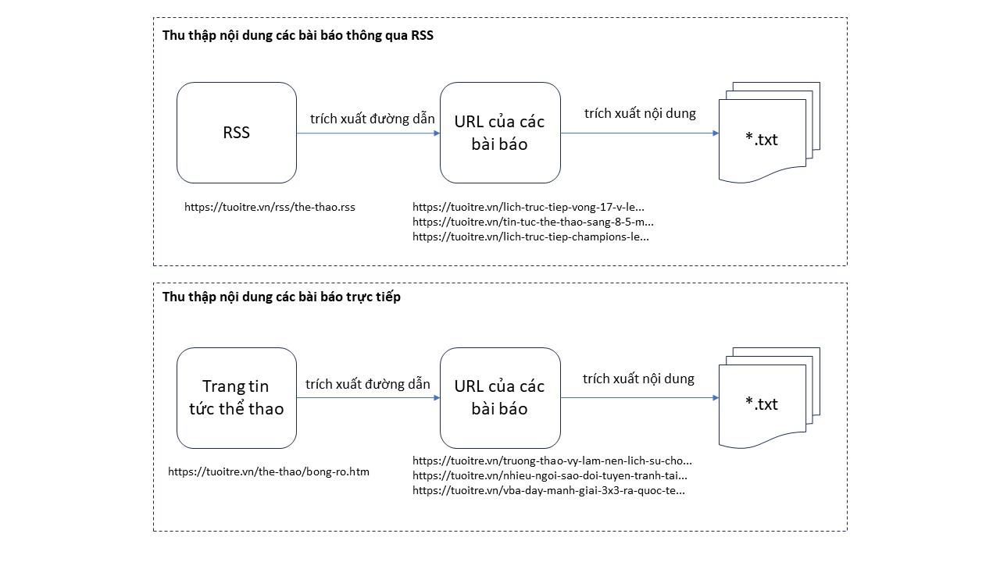
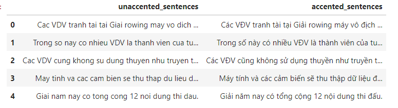
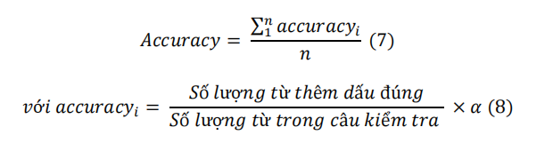
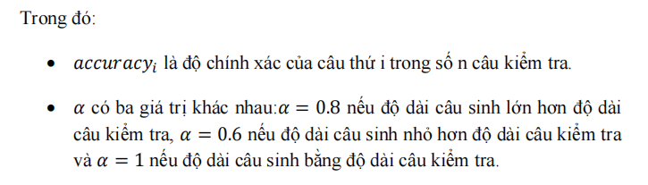

## Tổng quan

## Thu thập dữ liệu

Nội dung các bài báo thể thao được thu thập từ các trang báo điện tử phổ biến ở Việt Nam qua RSS và bằng cách truy xuất trực tiếp từ trang web với Selenium và Beautiful Soup.

Tổng số bài báo thu thập được: 10,768.

## Tiền xử lý dữ liệu

- Chuẩn hóa Unicode.
- Loại bỏ các ký tự đặc biệt, các đường dẫn.
- Tách câu với thư viện Underthesea.
- Bỏ dấu thanh ở mỗi câu.
- Loại bỏ những câu trùng nhau, những câu quá ngắn (có số lượng từ nhỏ hơn 5).

Các cặp câu không dấu - có dấu được phân chia vào các tập dữ liệu dưới dạng .csv

|  Tập dữ liệu  | Tổng số cặp câu |
|-----|-------|
| Train set    | 126,234  |
| Val set | 6,556  |
| Test set | 23,081  |

## Fine-tune mô hình ViT5

Mô hình ngôn ngữ ViT5 phiên bản ViT5 Base 1024-length được sử dụng để fine-tune với train set, tinh chỉnh siêu tham số huấn luyện dựa trên kết quả đánh giá với val set và so sánh kết quả giữa các lần fine-tune với test set.

Siêu tham số chung:

|  Siêu tham số  | Giá trị |
|-----|-------|
| Optimizer    | Adam  |
| Drop out | 0.1  |
| Batch size | 9  |

Siêu tham số tinh chỉnh:

|  Siêu tham số  | Lần 1 | Lần 2 | Lần 3 |
|-----|-------|-------|-------|
| Epoch    | 3  |3  |3  |
| Learning rate | 0.00001  |0.0003  |0.0005  |
| Weight decay | 0.01  |0.05  |0.05  |

## Kết quả

Đánh giá mỗi lần tinh chỉnh mô hình ViT5 với test set thông qua độ chính xác với công thức

|  Lần tinh chỉnh  | Độ chính xác |
|-----|-------|
| 1   | 98.07  |
| 2 | 97.64  |
| 3 | **98.5**  |

## Hạn chế

1. Giới hạn từ vựng. Cần thu thập thêm dữ liệu ở đa dạng lĩnh vực.
2. Cách tính độ chính xác chưa hiệu quả. Có thể xem bài toán này như một bài toán dịch máy, có thể sử dụng chỉ số như BLEU score thay thế.
3. Có thể phát triển bài toán từ tự động thêm dấu lên thành tự động sửa lỗi chính tả.

## Tham khảo

[1] Phan, Long, et al. "Vit5: Pretrained text-to-text transformer for vietnamese language generation." arXiv preprint arXiv:2205.06457 (2022)

[2] Vaswani, Ashish, et al. "Attention is all you need."Advances in neural information processing systems 30 (2017).

[3] [ViT5 Github repo](https://github.com/vietai/ViT5)